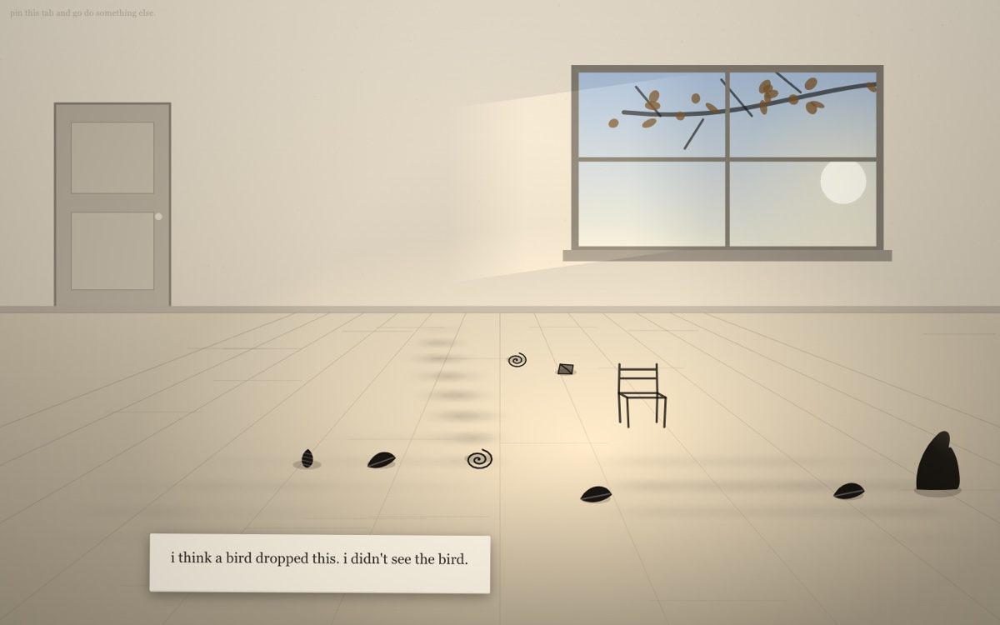
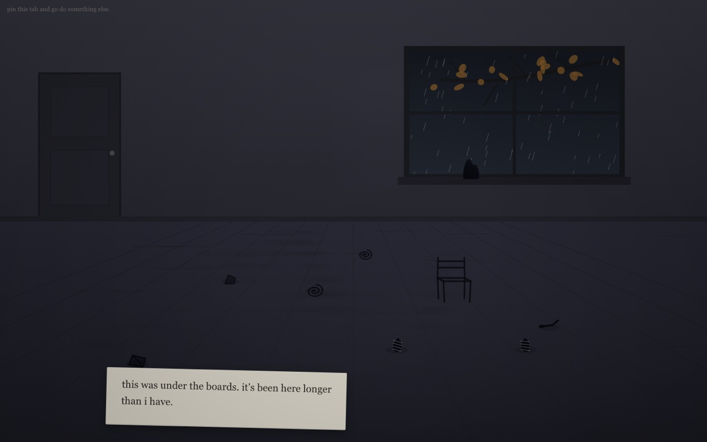

<h1 align="center">while away</h1>

<p align="center"><i>A room that only changes when you are not looking at it.</i></p>



> while you're looking at it, it won't move.

One HTML file. No dependencies, no build step, no server, no account, and **no network requests of any kind, ever**. Open it from `file://` with the network off and it works.

That last part is not a technical preference. It is the point.

## Why

*Tabikaeru* — a game about a frog who leaves, travels somewhere you cannot see, and comes home with postcards — shut down. It shut down because it needed someone else's servers.

This one doesn't.

## The rule

**While you are looking at it, it does nothing. When you go away, it lives.**

Switch to another tab, minimise the window, lock the screen — that is when it moves, makes things, goes places. You never see it happen. You come back to what is left: it is somewhere else now, there is something on the floor that was not there before, and there is a note.

There is no second rule. No score, no levels, no goals, no tutorial.

## Run it

```bash
curl -O https://raw.githubusercontent.com/renrenmimi/while-away/main/index.html
open index.html
```

Or just download the file and double-click it.

Then **pin the tab and go do something else.** A pinned tab survives a browser restart, which means this can live in your browser for months. That is the form this takes — not an install; a tab left open.

There is deliberately no hosted version. Serving it from a domain would put it back on somebody's servers, which is the thing it was built to avoid — and browsers evict script storage from real domains far sooner than the longest thresholds here need.

## Time

Absence buys different *kinds* of things, not more of the same. Two hours away is not worth twice one hour away; it is worth something else entirely.

The longest absences are worth the most. That inverts nearly every retention mechanic in software, and it is the reason this was worth building. Some of what is in here is genuinely rare, and most people will never see it. That is correct — it exists for the ones who do.

Nothing here fails, dies, gets sick, or needs feeding. Come back after six months and it is still there. It might say it wondered. It will never say you should have come sooner.

## What it is not

**Not Forest.** Forest punishes you for leaving its app — a dead tree, guilt as a mechanic. This has no failure state. You do not owe it anything. If you never leave, it simply waits, and it never complains.

**Not an idle game.** Idle games want you back constantly — notifications, red dots, *you earned 4,000 coins while away*. This wants you gone, and it will never ask you to return. There are no notifications. The tab title never changes.

**Not SCP-173.** The "it moves when unobserved" mechanic is well-worn in horror. Same rule, opposite feeling. Nothing here is ever threatening. It is not waiting to get you. It is just living its life around your absence.

Holding that third distinction is the whole design problem.



## The shape

You never see it clearly.

Because it is motionless whenever you are looking, what you see is a silhouette that gives nothing away — a thing that reads as alive but not as any specific animal. It has no face. Nothing follows your cursor.

**The evidence is the protagonist.** The notes, the objects, the path worn into the floor over weeks, the position it has moved to — those are drawn clearly and with care. The creature itself stays a shape.

You are not looking at a character. You are reading the traces of one.

The objects have no labels and no tooltips. A thing lying there with no account of itself is stronger than a caption, and there is nothing here to hunt for.

## The writing

The code was an evening's work. **The writing is the project.**

It never speaks aloud; it writes. Short, lowercase, plain punctuation — the way someone writes on a scrap of paper, not the way a game writes. It does not know where you went. It only knows you were not here, and roughly how long. That gap is where the feeling lives.

It is never needy, never cute, and it never counts your absence back at you.

## Technical

- One file, ~57 KB, vanilla everything. CSS and JS inline, all art drawn in code.
- All state in one versioned `localStorage` key. Worst case measured at ~30 KB.
- No timers and no animation loop. The scene is genuinely static while you are looking at it, and that stillness is doing real work. On becoming visible it takes the difference between now and the stored timestamp and resolves everything at once — one pure function, one coherent result, however long you were gone.
- The window tracks your real clock and calendar: light by the hour, weather and season by the date, hemisphere from your timezone. All of it derived locally; none of it fetched.
- Respects `prefers-reduced-motion`.
- If the clock jumps backwards, it does not defend against it. It says `i think i slept wrong. what time is it?` and carries on.

Closing the tab and switching tabs are indistinguishable by design.

## Contributing

Bug reports are welcome. Features are not — see *What it is not*, and note that the absence of UI here is deliberate rather than unfinished. The merged pull requests are worth reading if you want the honest version of how this was built, including one fix that opened a worse hole than the one it closed.
